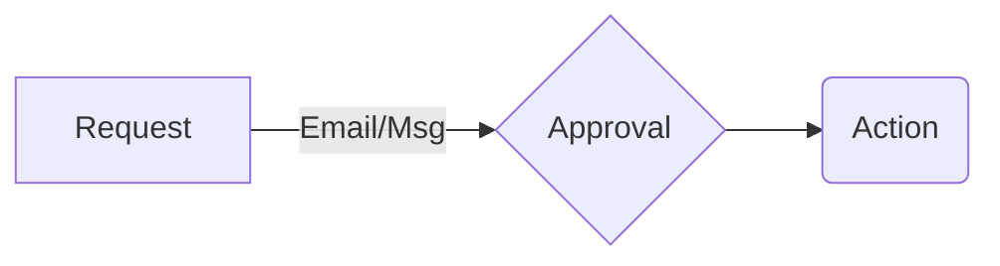

# AutoOps

During my time at Citi, had the opportunity to work on a Big-data operations team for a brief period. Much of the work was manual, like opening a Service Now ticket/email and running those commands on the Unix terminal and pasting the output back on the ticket/email.

Being a developer who loves automation and HATES manual work I longed for an "Operations Automation" tool that made my life easier.

After I left Citi, this problem still lingered in my head and for 2 years I researched various devops and operations tools, having found none, a few months ago decided to build it using Java and Angular. 

It dynamically generates smart forms for SSH commands and runs them on machines using a maker-checker based approval model and automates the grunt work of running the command, copying the output and responding to the requestor.

I believe in building algorithmically (best space-time complexity) and architecturally (scalable/designed for operational convenience) elegant solutions that are robust while being simple, following all the software architecture (SOLID) principles and design patterns (Gang of 4) and security policies (oneway hashing, etc..)

Thanks,
Samuel Kasimalla  

Video: https://www.youtube.com/watch?v=t63pdFpg1mc  
Live demo: http://3.230.199.13:8090/  

Credits: 
Samuel Kasimalla: Concept, design, architecture and original UI  
https://www.linkedin.com/in/skasimalla/  

Hal Keck : For most of Angular 8 work  
https://www.linkedin.com/in/halkeck/  

Harish Beeram : Design and UX  
https://www.linkedin.com/in/harishbeeram/  
 
Contact me on Linkedin for more information  
https://www.linkedin.com/in/skasimalla/  

